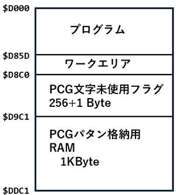

# PCG8100用グラフィックルーチン群とデモプログラム
ちくらっぺさん([@chiplappe](https://twitter.com/chiqlappe))の[新PCG](https://github.com/chiqlappe/new_pcg)のデモ用の
[ライブラリ](https://github.com/kazenif/new_pcg_demo)を
ベースに、PCG8100向けに移植したバージョンです。

40桁×25行モードで実行するので、320×200ドットのグラフィックが扱えます。

機能としては、

- 点を打つ
- ラインを引く
- 円を描く
- BOXを描く

が行えます。

- 描画実行時に、引数を追加 0:PSET(描画), 1:PRESET(消去), 2:XOR(XOR)の３つのモードを実現
- CIRCLEで同じ場所に２回プロットしないように、処理を追加

ソースをいじれば、80桁×40行でも実行可能ですが、すぐに文字が足りなくなりそうなので、
ドットが正方形になることも含めて、40桁モードを利用してます。

# 動作原理
最初にPCGのパタンを0で全クリア。画面を文字コード0で埋めておく。<br>
ドットをプロットする際は、次の手順で実行。

1. 当該位置に文字コード&H80 以上の文字が存在すれば、その文字に対して、ドットを追加
2. 文字が存在しない場合は、PCGの未使用文字を検索し、当該位置に文字を置き、ドットを追加。未使用文字を使用中と記録。
3. 未使用文字がない場合は、これ以上プロットできないものとして、プロットリクエストを無視。

# 利用時の準備
D000Hよりマシン語で書かれているので、BASICプログラムでは
```
CLEAR 300, &HCFFF
```
を記述してください。詳細な記述方法は、[デモプログラム](#デモプログラム)を参照ください。

新PCGをグラフィック画面的に使用するサブルーチン群は、```old_pcg_01.cmt```にマシン語ファイルとして格納されています。
プログラムは、ほぼ　[新PCG向けグラフィックライブラリ](https://github.com/kazenif/new_pcg)のプログラムがそのまま
使用できますが、ライブラリのエントリポイントが &HD000 から始まっているので、その点だけは修正してください。

ライブラリを&HC000 スタートにアセンブルしなおすことで、デモプログラムをそのまま使用することもできます。

# メモリマップ
メモリマップは以下の通り。PCG内の登録パタンを本体メモリ側に格納する必要があるため、それだけで1kByteのメモリが必要に
なります。PCG登録パタンの容量が少なくなったことから、ライブラリルーチンの開始アドレスを &HD000 からにしています。



# 基本的な使い方
DEF USR を使って、ユーザ関数として呼び出します。引数は、整数型です。

```
DEF USR1=&hD000 : A%=USR1(0)     : 'PCGの初期化
DEF USR2=&hD003 : A%=USR2(X1%)   : 'X1座標のセット
DEF USR3=&hD006 : A%=USR3(Y1%)   : 'Y1座標のセット
DEF USR4=&hD009 : A%=USR4(X2%)   : 'X2座標のセット
DEF USR5=&hD00C : A%=USR5(Y2%)   : 'Y2座標のセット
DEF USR6=&HD00F : A%=USR6(0|1|2) : 'PSET/PRESET/PXOR(X1, Y1) 実施。 引数0:PSET,1:PRESET,2:XOR
DEF USR7=&HD012 : A%=USR7(0|1|2|4|5|6|8|9|12) : '(X1,Y1)-(X2,Y2)にラインを描画。引数で，0:line, 1:line preset, 2:line xor, 4:box, 5:box preset, 6:box xor, 8:boxfill, 9:boxfill preset, 12:boxfill xor 実行
DEF USR8=&HD015 : A%=USR8(0|1|2) : '(X1,Y1)を中心に半径X2 の円を描く。引数0:PSET,1:PRESET,2:XOR
DEF USR9=&HD018 : A%=USR9(0)     : 'バッファフラッシュ
```

## 初期化(画面クリア)
PCGや画面の初期化は、&HD000 のルーチンで行います。
```
DEF USR1=&hD000 : A%=USR1(0): 'PCGの初期化
LOCATE 0,0,0                : 'カーソル非表示
```
40桁×25行、白黒モードで初期化されます。
また、カーソルは ```locate 0,0,0``` で非表示にしておくとよいです。

### pset
グラフィックで(X%, Y%)座標に１点プロットを打つ手順は以下の通り

1. ```DEF USR2=&HD003``` の ```A%=USR2(X%)``` でX座標を指定、
2. ```DEF USR3=&HD006``` の ```A%=USR3(Y%)``` でY座標を指定
3. ```DEF USR6=&HD00F``` の ```A%=USR6(0|1|2)```でPSET実行.引数0:PSET,1:PRESET,2:XOR
4. 1～3を必要なだけ繰り返す
5. ```DEF USR9=&HD018``` の ```A%=USR9(0)```でバッファ上のPCGの設定を反映させる

プロットは、16点プロットされるごとに、PCGに対してVSYNC待ちを行い、反映されます。
毎回PCGに対して反映させたい場合は、明示的に```A%=USR9(0)```を実行してください。

### line, box, boxfill
グラフィックで(X1%, Y1%)-(X2%,Y2%)に直線を描画する

1. ```DEF USR2=&HD003``` の ```A%=USR2(X1%)``` でX1座標を指定、
2. ```DEF USR3=&HD006``` の ```A%=USR3(Y1%)``` でY1座標を指定
3. ```DEF USR4=&HD009``` の ```A%=USR4(X2%)``` でX2座標を指定、
4. ```DEF USR5=&HD00C``` の ```A%=USR5(Y2%)``` でY2座標を指定
5. ```DEF USR7=&HD012``` の ```A%=USR7(0|1|2|4|5|6|8|9|12)``` 引数により　0:line, 1:line preset, 2:line xor, 4:box, 5:box preset, 6:box xor, 8:boxfill, 9:boxfill preset, 12:boxfill xor 実行
6. 1～5を必要なだけ繰り返す
7. ```DEF USR9=&HD018``` の ```A%=USR9(0)```でバッファ上のPCGの設定を反映させる

line では、内部的に pset 機能が呼び出され、16点プロットされるごとに、
PCGに対してVSYNC待ちを行い、反映されます。毎回PCGに対して反映させたい場合は、
明示的に```A%=USR9(0)```を実行してください。

### circle
グラフィックで、(X%, Y%)座標を中心、半径R%の円を描く

1. ```DEF USR2=&HD003``` の ```A%=USR2(X%)``` でX座標を指定、
2. ```DEF USR3=&HD006``` の ```A%=USR3(Y%)``` でY座標を指定
3. ```DEF USR4=&HD009``` の ```A%=USR4(R%)``` で半径を指定、
4. ```DEF USR8=&HD015``` の ```A%=USR8(0|1|2)``` でcircle実行.引数0:PSET,1:PRESET,2:XOR
5. 1～4を必要なだけ繰り返す
6. ```DEF USR9=&HD018``` の ```A%=USR9(0)```でバッファ上のPCGの設定を反映させる

circle では、内部的に pset 機能が呼び出され、16点プロットされるごとに、
PCGに対してVSYNC待ちを行い、反映されます。基本的に、circleでは円を８分割して描画して
いるので、毎回バッファのフラッシュを行う必要はなく、
最後に```A%=USR9(0)```を実行するだけで十分だと考えられます。


#### 円描画アルゴリズム
円描画アルゴリズムは、[伝説のお茶の間](https://dencha.ojaru.jp/index.html)で解説されている、
[ミッチェナー(Miechener) の円描画](https://dencha.ojaru.jp/programs_07/pg_graphic_09a1.html)の
コードをベースに、同じ点を２度プロットしないような条件を加えたコードになっています。

コード修正の目的は、XOR 描画モードで描画しても、途中で途切れることや、２回 XOR 描画モードで描画した際の消し忘れ
が起きないようにするためのものです。

```
void MiechenerCircle (HDC hdc, LONG radius, POINT center, COLORREF col){
    LONG cx, cy, d;

    d = 3 - 2 * radius;
    cy = radius;

    // 開始点の描画
    SetPixel (hdc, center.x, radius + center.y, col);   // point (0, R);
    SetPixel (hdc, center.x, -radius + center.y, col);  // point (0, -R);
    SetPixel (hdc, radius + center.x, center.y, col);   // point (R, 0);
    SetPixel (hdc, -radius + center.x, center.y, col);  // point (-R, 0);

    for (cx = 0; cx <= cy; cx++) {
        if (d < 0)  d += 6  + 4 * cx;
        else        d += 10 + 4 * cx - 4 * cy--;

        // 描画 ※ブロック内の２つのif文は、２度同じ場所にプロットしない為のコード
        if (cx <= cy) {
            SetPixel (hdc,  cy + center.x,  cx + center.y, col);        // 0-45     度の間
            SetPixel (hdc, -cx + center.x,  cy + center.y, col);        // 90-135   度の間
            SetPixel (hdc, -cy + center.x, -cx + center.y, col);        // 180-225  度の間
            SetPixel (hdc,  cx + center.x, -cy + center.y, col);        // 270-315  度の間
        
            if (cx != cy) {
                SetPixel (hdc,  cx + center.x,  cy + center.y, col);    // 45-90    度の間
                SetPixel (hdc, -cy + center.x,  cx + center.y, col);    // 135-180  度の間
                SetPixel (hdc, -cx + center.x, -cy + center.y, col);    // 225-270  度の間
                SetPixel (hdc,  cy + center.x, -cx + center.y, col);    // 315-360  度の間
            }
        }
    }
}
```

# デモプログラム
本ライブラリとN-BASICで書かれたデモプログラムのCMTファイルを4個用意しました。

## 3D demo プログラム
[00_OLDPCG_3D.CMT](./00_OLDPCG_3D.CMT) で、マシン語とBASICからなります。実行には、2分30秒程度かかります。
128文字のPCGでは、こういった点が高密度でプロットされている図形の場合、90ドット×90ドット程度の領域しか表現
することができず、普通にPC-8001のセミグラフィックを使ってもあまり変わらないようなドット数の図形にしかなりません。

```
mon
*L
*[Ctrl+B]
cload"DEMO"
run
```

```
10000 '
10010 ' 3D plot demo for PCG-8100 graphic routines
10020 '
10030 CLEAR 300,&HCFFF
10040 TIME$="00:00:00":LOCATE 0,0,0
10050 DEF USR1=&HD000:A=USR1(0)
10060 DEF USR2=&HD003:DEF USR3=&HD006:DEF USR4=&HD00F:DEF USR5=&HD018
10070 DIM DT%(255),DB%(255):DR=3.14/90
10080 FOR I=0 TO 255:DT%(I)=192:DB%(I)=-1:NEXT
10090 FOR Y=-45 TO 45 STEP 3:FOR X=-90 TO 90 STEP 6
10100 R=DR*SQR(X*X+Y*Y*4):Z=50*COS(R)-15*COS(3*R)
10110 SX%=INT(128+X-Y):SY%=INT(80-Y-Z):PS=0
10120 IF SX%<0 OR 255<SX% THEN 10160
10130 IF DT%(SX%)>SY% THEN DT%(SX%)=SY%:PS=1
10140 IF DB%(SX%)<SY% THEN DB%(SX%)=SY%:PS=1
10150 IF PS THEN A%=USR2(INT(SX%*.55+92)):A%=USR3(INT(SY%*.55+60)):A%=USR4(0)
10160 A%=USR5(0):NEXT X,Y
10170 COLOR 8:LOCATE 16,24:PRINT TIME$;
10180 A$=INKEY$:IF A$="" GOTO 10180
10190 LOCATE 0,0,1:PRINT CHR$(12):WIDTH 80,25
```

## circle デモプログラム
[00_OLDPCG_CIRCLE.CMT](./00_OLDPCG_CIRCLE.CMT) で、マシン語とBASICからなります。ほぼすべての処理がマシン語で実行されることと、５個しか円を描いていないので、実行時間は約1秒
```
mon
*L
*[Ctrl+B]
cload"DEMO"
run
```


```
1000 CLEAR 300,&HCFFF
1010 TIME$="00:00:00":LOCATE 0,0,0
1020 DEF USR1=&HD000:A=USR1(0)
1030 DEF USR2=&HD003:DEF USR3=&HD006:DEF USR4=&HD009:DEF USR5=&HD015
1040 DEF USR6=&HD015
1050 FOR I%=0 TO 5
1060 X0%=RND(1)*240+70:Y0%=RND(1)*160+20:R%=RND(1)*35+5
1070 A%=USR2(X0%):A%=USR3(Y0%):A%=USR4(R%):A%=USR5(0)
1080 NEXT
1090 COLOR 8:LOCATE 16,24:PRINT TIME$;
1100 A$=INKEY$:IF A$="" GOTO 1100
1110 LOCATE 0,0,1:PRINT CHR$(12):WIDTH 80,25
```

## line デモプログラム
[00_OLDPCG_LINE.CMT](./00_OLDPCG_LINE.CMT) で、マシン語とBASICからなります。新PCG版と比べると、描画領域は小さくせざるを得ないため、実行時間は約23秒
```
mon
*L
*[Ctrl+B]
cload"DEMO"
run
```


```
1000 CLEAR 300,&HCFFF
1010 TIME$="00:00:00":LOCATE 0,0,0
1020 DEF USR1=&HD000:A=USR1(0)
1030 DEF USR2=&HD003:DEF USR3=&HD006:DEF USR4=&HD009:DEF USR5=&HD00C
1040 DEF USR6=&HD012:DEF USR7=&HD018
1050 '
1060 X1%=116:Y1%=50
1070 FOR T%=0 TO 110 STEP 2
1080 X0%=X1%:Y0%=Y1%:X1%=T%+116:Y1%=15*SIN(T%/32*3.1415)+50
1090 A%=USR2(X0%):A%=USR3(Y0%):A%=USR4(X1%):A%=USR5(Y1%):A%=USR6(0)
1100 A%=USR7(0):NEXT
1110 '
1120 X1%=116:Y1%=100
1130 FOR T=0 TO 110 STEP .5
1140 X0%=X1%:Y0%=Y1%:X1%=T+116:Y1%=15*SIN(T/16*3.1415)+100
1150 A%=USR2(X0%):A%=USR3(Y0%):A%=USR4(X1%):A%=USR5(Y1%):A%=USR6(0)
1160 A%=USR7(0):NEXT
1170 '
1180 X1%=116:Y1%=150
1190 FOR T%=0 TO 110
1200 X0%=X1%:Y0%=Y1%:X1%=T%+116:Y1%=15*SIN(T%/8*3.1415)+150
1210 A%=USR2(X0%):A%=USR3(Y0%):A%=USR4(X1%):A%=USR5(Y1%):A%=USR6(0)
1220 A%=USR7(0):NEXT
1230 '
1240 COLOR 8:LOCATE 16,24:PRINT TIME$;
1250 A$=INKEY$:IF A$="" GOTO 1250
1260 LOCATE 0,0,1:WIDTH 80,25:PRINT CHR$(12)
```

## boxfill デモプログラム
[00_OLDPCG_BOX.CMT](./00_OLDPCG_BOX.CMT) で、マシン語とBASICからなります。XORによる不思議なふるまいを楽しんでください。実行時間は約50秒
```
mon
*L
*[Ctrl+B]
cload"DEMO"
run
```

```
10000 '
10010 ' Demonstration of XOR circle, box, and box fill
10020 '
10030 CLEAR 300,&HCFFF
10040 TIME$="00:00:00"
10050 DEF USR1=&HD000:A=USR1(0)
10060 DEF USR2=&HD003:DEF USR3=&HD006:DEF USR4=&HD009:DEF USR5=&HD00C
10070 DEF USR6=&HD015:DEF USR7=&HD00F:DEF USR8=&HD012:DEF USR9=&HD018
10080 '
10090 FOR I%=1 TO 45 STEP 5
10100 A%=USR2(160):A%=USR3(100):A%=USR4(I%):A%=USR6(2)
10110 NEXT
10120 '
10130 A%=USR2(121):A%=USR3(61):A%=USR4(199):A%=USR5(139):A%=USR8(10)
10140 '
10150 FOR I%=1 TO 45 STEP 5
10160 A%=USR2(160):A%=USR3(100):A%=USR4(I%):A%=USR6(2)
10170 NEXT
10180 '
10190 FOR I%=4 TO 35 STEP 4
10200 A%=USR2(121+I%):A%=USR3(61+I%):A%=USR4(199-I%):A%=USR5(139-I%):A%=USR8(6)
10210 NEXT
10220 '
10230 FOR I%=1 TO 45 STEP 5
10240 A%=USR2(160):A%=USR3(100):A%=USR4(I%):A%=USR6(2)
10250 NEXT
10260 '
10270 A%=USR2(121):A%=USR3(61):A%=USR4(199):A%=USR5(139):A%=USR8(10)
10280 '
10290 FOR I%=4 TO 35 STEP 4
10300 A%=USR2(121+I%):A%=USR3(61+I%):A%=USR4(199-I%):A%=USR5(139-I%):A%=USR8(6)
10310 NEXT
10320 '
10330 COLOR 8:LOCATE 16,24:PRINT TIME$;
10340 A$=INKEY$:IF A$="" GOTO 10340
10350 LOCATE 0,0,1:OUT 8,0:PRINT CHR$(12):WIDTH 80,25

```

